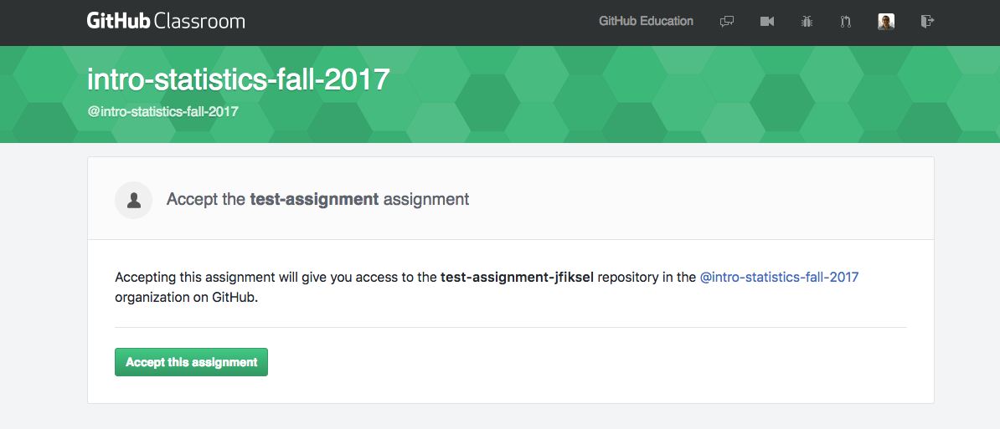

# GitHub Classroom Guide for Students

This is a guide for students to setup Git and GitHub for use with GitHub Classroom.

### Steps for getting setup with GitHub
1. Register for account on GitHub (https://github.com/). We recommend using a username that incorporates your UNO NetID.

2. Install Git. Windows: https://gitforwindows.org/. Mac should already have it installed if you are running anything above Mavericks (10.9). To see if you if it is installed, open Terminal and type "git --version". If it isn't installed, it will prompt you to install it. For linux, should also already have git, but if not you can install it by running "sudo apt install git-all" or "sudo dnf install git-all".

3. Setup options in Git. Open up a Terminal or Command Prompt and cd into the project directory. Once there, we need to run a couple commands to set up git. The first command is your name, the second command is the email associated with your GitHub account.

git config --global user.name 'Jane Doe'
git config --global user.email 'student@email.com'

### Make a repo on GitHub

You can skip this step if you are provided a repo through Github Classroom as once you accept the assignment, it creates a repo for you.

Below we make a repository and copy the link so that we can get the repository onto our own computer.

### Clone the repo to your local computer
On your Command Window, cd to wherever you would like your project/repository to be placed. Then run "git clone https://github.com/User/repository.git
This will clone the repo to that location, unless specified otherwise. 

### Make a local change, commit, and push and confirm the local change propogated to the GitHub Remote
Once you made changes to your files and need to push (upload) them to your repository, use these commands in a command window in that assignment directory.

git add -a (If -a doesn't work, try --a, or instead of -a, you can put the file name if you just want to upload certain files)
git commit -m "Put a meaningful comment here describing what you did"
git remote add origin https://github.com/Classroom/repo (This link will be the link to your repository/assignment)
git push -u origin master

Once you run these commands, it will ask for your username (email) and password.
After you push these, you may want to run another command so you don't have to continue entering your info.

Timed (15 minutes) - git config --global credential.helper cache
Timed (specifically) - git config --global credential.helper "cache --timeout=3600"
Permanently - git config --global credential.helper manager

### Steps for downloading and editing assignments from GitHub Classroom on Odin, Linux, or Mac

1. Make a folder specifically for your class (call it something like classroom-fall-2017). You can do this by using the command mkdir. For example, "mkdir homework" will create a folder at the location you are in with the name homework. It is recommended that you do not have spaces in your folder or file names. Spaces are best shown as underscores (\_). You can then navigate into that folder by typing "cd homework" or whatever you named it.

And here is what the process of creating these directories looks like from the terminal on a Mac, but the process works the same on linux or Odin:

2.  The professor will give you a link to an assignment, either through email or the class page. This will happen for each new assignment. Follow the instructions for getting the homework repository set up. You should now have a repository for this homework. Note that after you accept an assignment for the first time, you may get an invite to join the classroom organization as a member. Please accept this. You will probably get an email with the invitation, but you should also see a link at the top of your main GitHub page. Here is an image of what you should see after clicking the link:

3. Enter the homework repository on GitHub (this is online--GitHub is different from Git!). Click “Clone or Download”, and make sure it says “Clone with HTTPS” in bold in the top left of the pop-up box. If not, click on the blue “Use HTTPS” button on the top right of the pop-up box. Now copy the link in the box to your clipboard.

4.  After copying the link, you would now create the folder, cd into it, and use the instructions provided about to clone the homework.

Note that if you received an error in the above steps, you may have to clone with SSH instead of HTTPS. You can do this by again clicking on the "Clone or Download" button in the repository page, then clicking "Use SSH" in the top right of the pop-up box. Now copy the link and repeat this step.

5.  After you make changes to the homework assignment, commit them. What are commits you ask? Commits are essentially taking a snapshot of your projects. For example, if you make changes to a code so that it prints "Hello world", and then commit them with an informative message, you can look at the history of your commits and view the code that you wrote at that time. If you made some more changes to the function that resulted in an error, you could go back to the commit where the code was originally working. This prevents you from creating several versions of your homework (homework-v1, homework-v2, ...) or from trying to remember what your code originally looked like. This will also allow professors to see what you all do and can help them or assistants find where you made a mistake and correct the problem!

Two things about committing. One, you should commit somewhat frequently. At minimum, if you're doing a homework assignment, you should make a commit each time that you've finished a question. Two, leave informative commit messages. "Added stuff" will not help you if you're looking at your commit history in a year. A message like "Added initial version of hello-world function" will be more useful.

6.  At some point you'll want to get the updated version of the assignment back onto GitHub. This is where the "git push -u origin master" command comes in handy!

### Obtaining and pulling a shared repository

Your classroom may have a repository where everyone in the class has access to it, such as a class materials repository. This repository will probably be updated throughout the class, and it will be useful to constantly have the most updated materials on your local computer. You can do this by first cloning the repository, and then pulling in changes. So you may want to create a folder that can hold this stuff, navigate your way into that folder, and follow the cloning steps to get the repository. After that, if you are told or notice there are changes to the repository, instead of cloning the whole thing, you can just use git pull. This will update files in your repository that need to be updated. If you get an error about merge conflict, don't freak out! This can happen if you edit locations in files that are also changed by a professor. Professors should be doing their best to ensure this doesn't happen, but if it does, simply contact your professor or TA to get it worked out. Or even better, try to google the error message and try to fix it yourself!

### Resources
* [Happy Git and GitHub for the useR](http://happygitwithr.com/)
* [The Unix Workbench](http://seankross.com/the-unix-workbench/)
* [Interactive learning guide for Git](http://learngitbranching.js.org/)
* [GitHub Guides](https://guides.github.com/)
* [Git setup for Windows (video)](https://youtu.be/F_fPEMnr1OQ)
* [Git setup for Mac (video)](https://www.youtube.com/watch?v=kbmSZwK0k-A&t)
* [How to clone, edit, and push homework assignments with GitHub Classroom (video)](https://youtu.be/pAcMgGbCtQw)

### Credits
This guide was derived from https://github.com/jfiksel/github-classroom-for-students
